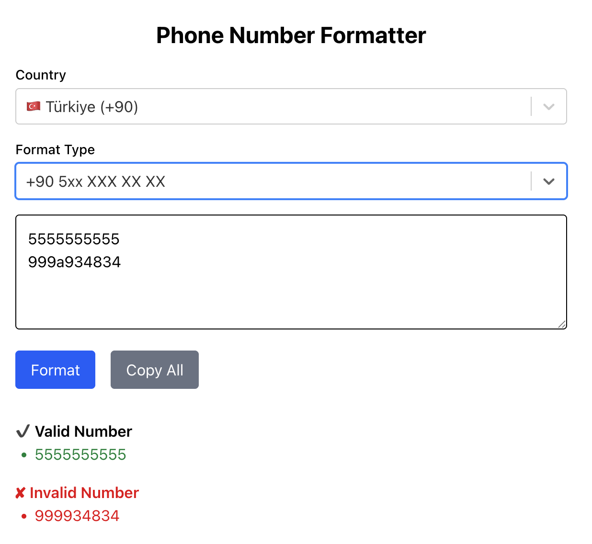

# 📞 phone-formatter

**phone-formatter** is an open-source web tool that lets you quickly clean and format multiple phone numbers at once.  
The initial release supports only **Turkish (+90)** numbers, but the structure is built to support multiple countries in the future.

> 🧩 Ideal for CRM exports, campaign lists, WhatsApp messages, Excel clean-up, and more.

---

## 🖼 Preview



## 🚀 Features

- ✅ Paste bulk phone numbers separated by newline, comma, semicolon, etc.
- ✅ Automatically cleans non-numeric characters
- ✅ Validates numbers based on the selected country's mobile number rules (currently only Türkiye supported)
- ✅ Choose your output format:
  - `+90 5xx XXX XX XX`
  - `+905xxxxxxxxx`
  - `05xxxxxxxxx`
  - `5xxxxxxxxx`
- ✅ Copy all with one click
- ✅ Simple, mobile-friendly interface
- ✅ Country selection (currently only 🇹🇷 Türkiye)

---

## 🌍 Planned Features

- 🌐 Multi-country support (🇺🇸 🇩🇪 🇬🇧 etc.)
- 🌐 Multi-language support
- 📤 Export formatted numbers as CSV or TXT
- 🎨 Dark mode toggle

---

## 🛠 Tech Stack

- [Next.js](https://nextjs.org/) + App Router
- [TypeScript](https://www.typescriptlang.org/)
- [Tailwind CSS](https://tailwindcss.com/)
- [React Select](https://react-select.com/)

---

## 🧪 Running Locally

```bash
git clone https://github.com/umurakbulut/phone-formatter.git
cd phone-formatter
npm install
npm run dev
```

Then open [http://localhost:3000](http://localhost:3000)

---

## 📄 License

MIT — see the [LICENSE](./LICENSE) file for details.

---

## ☕ Support

If this project helped you or saved you time, you can support me here:

👉 [buymeacoffee.com/umur](https://buymeacoffee.com/umur)

---

## 🤝 Contributions

Pull requests and feature ideas are welcome!
